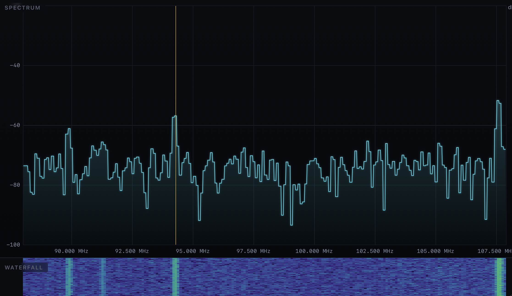

# Aetherscope



[](https://github.com/clorth0/aetherscope/actions/workflows/ci.yml)
[](https://github.com/clorth0/aetherscope/releases)
[](LICENSE)

A self-hosted browser UI for a [HackRF One](https://greatscottgadgets.com/hackrf/)
SDR: a live spectrum analyzer, AM/FM/NBFM you can actually listen to, ISM device
decoding, ADS-B aircraft tracking, IQ capture and offline replay, and a one-click
survey scan. Built for a homelab security-RX workflow.

Binds to `127.0.0.1` only, meant to be reached over Tailscale or `ssh -L`.

## Highlights

- **Spectrum analyzer:** live FFT + scrolling waterfall (1 Hz to 6 GHz), max-hold
  and average traces, a live peak table with SNR, click-drag zoom, hover and
  click-to-mark, and dB-offset calibration.
- **Radio:** listen in the browser. FM broadcast, narrowband FM (land mobile,
  GMRS, ham), and AM (airband). A scanner cycles your marked frequencies and
  stops on activity.
- **Capture and replay:** record IQ to disk, then replay a recording as an
  offline spectrogram.
- **Decode and track:** rtl_433 ISM devices and ADS-B aircraft on a map.
- **Auto-Scan:** sequential survey (sweep, ISM, ADS-B) with a band-classified
  report.
- **Built to trust:** a diagnostics/telemetry panel, a strict CSP with vendored
  dependencies (works offline), input validation, and CI.

## Modes

| Mode | What it does | Tool |
|---|---|---|
| **Sweep** | FFT + waterfall, max-hold, peak table, zoom, marks | `hackrf_sweep` |
| **Radio** | AM / FM / NBFM audio + scanner | `hackrf_transfer` + numpy/scipy |
| **Capture** | Record IQ to disk + JSON sidecar | `hackrf_transfer` |
| **Replay** | Play a saved capture back as a spectrogram | offline |
| **Decode** | ISM device decoding (315 / 433 / 868 / 915 MHz) | `rtl_433` + SoapySDR |
| **ADS-B** | Aircraft on a Leaflet map | `readsb-hackrf` |
| **Auto-Scan** | Sweep, ISM, ADS-B, report | all of the above |

## Quickstart (macOS)

```sh
git clone https://github.com/clorth0/aetherscope.git
cd aetherscope
./deploy/install.sh
uv run aetherscope        # then open http://127.0.0.1:8765/
```

Requirements, the launchd service, and updating are in [docs/install.md](docs/install.md).

## Reach it remotely

Over Tailscale or an `ssh -L` tunnel it needs no extra setup. To expose it, put
TLS + auth in front (Caddy recipe) or run the Linux container. See
[docs/deployment.md](docs/deployment.md).

## Docs

- [Install and run](docs/install.md)
- [Configuration](docs/configuration.md)
- [Deployment (Caddy, Docker)](docs/deployment.md)
- [Architecture](docs/architecture.md)
- [Security policy](SECURITY.md)

## Security

Localhost-only by design, with no built-in authentication. Do not put it on a
public interface without your own access controls. Report issues privately via
the repository's Security tab. See [SECURITY.md](SECURITY.md).

## License

MIT. See [LICENSE](LICENSE).
